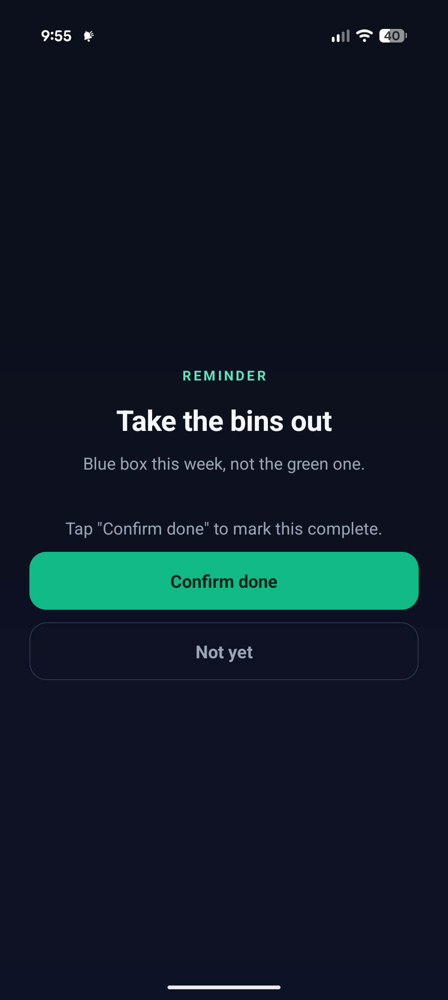
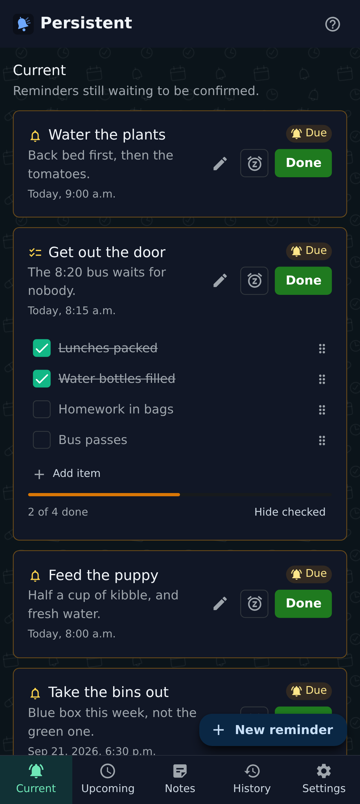
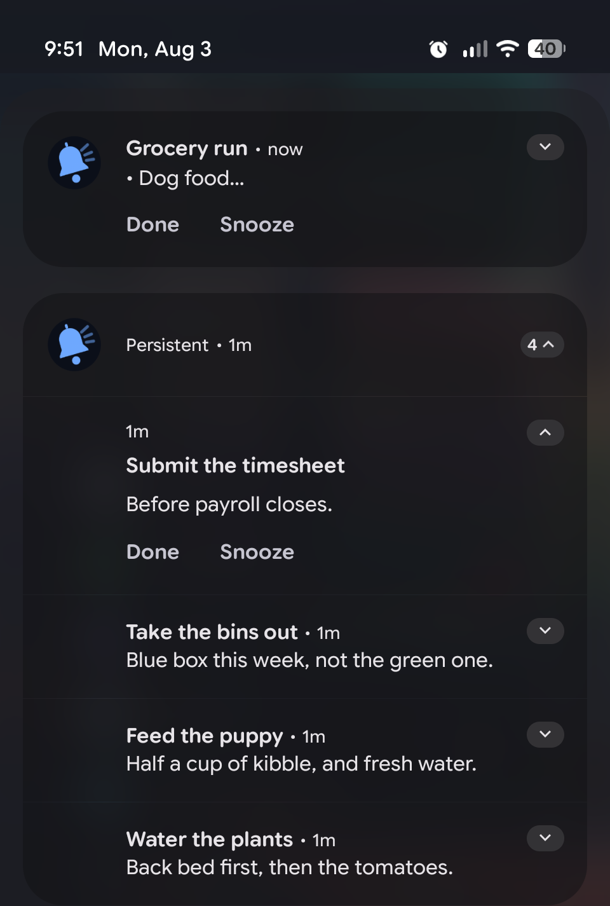

  

<h1 align="center">Persistent</h1>

  Reminders that don't give up — they keep nagging until you <em>actually</em> mark them done.

  

  
  &nbsp;
  

<!-- Sized by height, not width: the shade shot is a different aspect ratio to the
     phone screens, so a shared height is what keeps the row aligned. -->

  
  
  

Most reminder apps fire once and are easy to swipe away. Persistent keeps
nagging — a notification that won't dismiss, or a full alarm that loops — until
you *actually mark it done*. It's built for the things you can't afford to miss.

## What makes it different

- **It won't be ignored.** Choose a persistent notification that re-sounds, or a
  full-screen alarm that rings continuously until you confirm — even with the
  phone locked.
- **Escalation.** If you still haven't acted, it can escalate to a louder alarm
  on your devices and email a chosen contact — with your covering message and what
  is actually overdue, so they can act on it — and you can silence that alarm
  without losing the reminder, so it keeps nagging quietly.
- **Nothing slips through.** Every firing is tracked on its own. If a reminder
  has several times of day, each one nags and is confirmed separately —
  confirming the 1:00 firing never silently clears the 9:00 one you missed.
- **Works offline.** The Android app schedules exact on-device alarms, so
  reminders fire even with no signal, and sync across your devices.
- **Flexible.** Remind me now with no date to pick, a one-time or repeating
  schedule — daily, weekdays, every N days, or monthly on the days you choose
  (including the last day of every month) — or never at all, for something you
  want to keep but never be reminded about. Multi-line notes that stay multi-line
  wherever you read them; custom snooze and re-nag intervals, separate tones for a
  reminder firing and for its follow-up nags, per-reminder notification-shade
  prominence (Android), and a history of what you've done.
- **Checklists.** A reminder can cover several things at once — a morning routine,
  a packing list. Tick items off as you go; each firing tracks its own ticks, so a
  repeating checklist starts fresh every time, and the notification lists only what
  you have left. Hide the ticked ones to see just what's outstanding — a long list
  stays collapsed the way you left it, on every device you use. Ticking everything
  still doesn't confirm it — only you do.
- **Simple sign-in.** A one-time email code, a passkey, or Sign in with Google —
  there is no password to forget or leak.
- **Your data stays yours.** No ads, no analytics, no tracking. Delete your
  account and everything in it from Settings, at any time; see the
  [privacy policy](https://persistent.dynamic-solutions.ca/privacy).

## Get it

**Web:** open [persistent.dynamic-solutions.ca](https://persistent.dynamic-solutions.ca)
in any browser and sign up free. It installs as a web app, with best-effort
reminders — same account and same live data as every other surface.

**Android (recommended):** download the APK from the
[latest release](https://github.com/RyanEwen/persistent/releases/latest). The app
is where the unmissable alarm guarantees live, and it updates itself.

**Windows:** a tray app that keeps Persistent one click from the notification
area. Grab the portable zip for your architecture (x64 or ARM64) from the
[latest `desktop-v*` release](https://github.com/RyanEwen/persistent/releases?q=desktop&expanded=true) — unzip
and run, nothing to install — or the MSIX if you'd rather have a proper install.
It's for seeing and confirming reminders at your desk, and it can show optional
Windows notifications with Done and Snooze on them — but it never rings an alarm
and can't reach you when it's closed or the PC is asleep.

> Both apps publish into the same release list, so browsing it raw interleaves
> them. The Android app is tagged `vX.Y.Z` and is always the one marked **Latest**;
> the Windows tray app is tagged `desktop-vX.Y.Z`. The links above already filter
> to the right one.

## Why the app over the web?

Truly undismissable notifications and a looping alarm while your phone is locked
are things only a native app can guarantee. The web and Windows versions are great
for managing your reminders and confirming them as you go, but for the hard "you
will not miss this" behavior, use the Android app.

## Developers

Setup, architecture, and the release/deploy workflow are in
[docs/development.md](docs/development.md).

## License

UNLICENSED — private.
