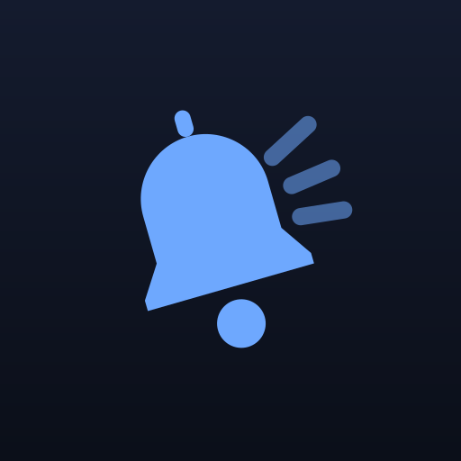
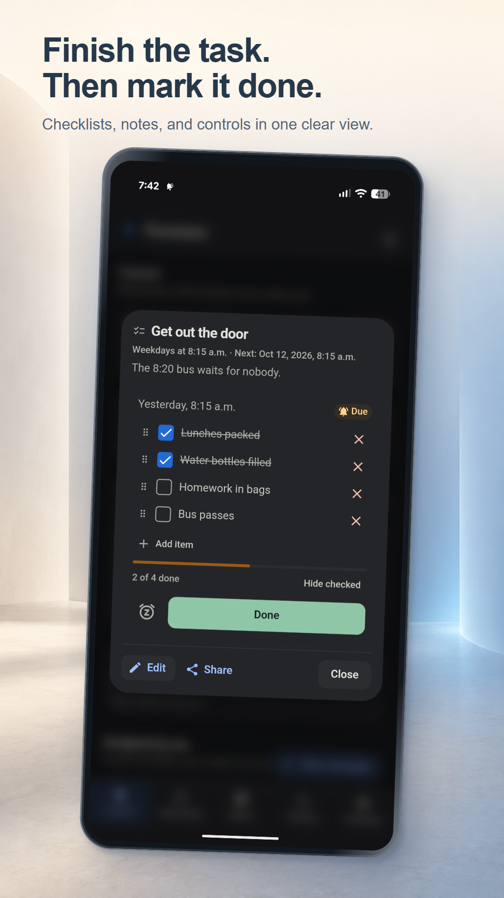

  

<h1 align="center">Persistent</h1>

  Reminders that don't give up — they keep nagging until you <em>actually</em> mark them done.

  

  

<!-- The official Store badge, matching the sibling Dynamic Solutions Canada apps. It sits on
     its own row rather than beside the shields badges above because it is 56px tall
     and they are not. Windows has no shields badge any more: the Store is the
     install route, and the portable zip on a release is covered under "Get it". -->

  

<!-- These are the same synthetic-data mockups used by the Play listing. -->

  
  
  

Most reminder apps fire once and are easy to swipe away. Persistent keeps
nagging — a notification that won't dismiss, or a full alarm that loops — until
you *actually mark it done*. It's built for the things you can't afford to miss.

Choose your appearance in **Settings > Theme**: **Match system** is the default
and automatically switches between Enjoy Light and Enjoy Dark with your device.
Choose either Enjoy theme to keep one appearance. Classic Light and Classic Dark
retain the previous styling, and Forest and Plum offer colored palettes. Each palette
recolors the whole app, including cards and dialogs. Navy keeps the original
dark blue surfaces and teal accents. Doodles are enabled by default. The
Enjoy themes use warm gray surfaces, blue accents,
rounded headings and controls, quiet surfaces, and soft shadows inspired by
[Enjoy's app](https://enjoy.dev). Native alarm screens inherit their colors;
their fonts and shapes follow the platform. For a plain Enjoy appearance,
choose No doodles without changing your saved palette. The
**Doodle background** dropdown offers Match theme, No doodles, and doodle line
colors from pale shades for Light or dark shades for the darker themes. The
page background follows your theme. Your choices are saved on each device.

Existing Navy settings and retired Navy variants switch to Match system once,
keeping their doodle preferences. You can select Navy again afterward.

**Settings > Account** brings your account details, passkeys, sign-out, and
permanent deletion together. **Settings > Apps > Our other apps** lists our
other products with platform labels and links, including Windows apps.

## What makes it different

- **It won't be ignored.** Choose a persistent notification that re-sounds, or a
  full-screen alarm that rings continuously until you confirm — even with the
  phone locked.
- **Escalation.** If you still haven't acted, it can escalate to a louder alarm
  on your devices and email a chosen contact — with your covering message and what
  is actually overdue, so they can act on it — and you can silence that alarm
  without losing the reminder, so it keeps nagging quietly.
- **Nothing slips through.** Every firing is tracked on its own. If a reminder
  has several times of day, each one nags and is confirmed separately —
  confirming the 1:00 firing never silently clears the 9:00 one you missed.
- **Works offline.** The Android app schedules exact on-device alarms, so
  reminders fire even with no signal, and sync across your devices.
- **Flexible.** Remind me now with no date to pick, a one-time or repeating
  schedule — daily, weekdays, every N days, or monthly on the days you choose
  (including the last day of every month) — or never at all, for something you
  want to keep but never be reminded about. Multi-line notes that stay multi-line
  wherever you read them; custom snooze and re-nag intervals, separate tones for a
  reminder firing and for its follow-up nags (and any single reminder can use its
  own tones instead of your device's), per-reminder notification-shade prominence
  (Android), and a history of what you've done.
- **Checklists.** A reminder can cover several things at once — a morning routine,
  a packing list. Tick items off as you go; each firing tracks its own ticks, so a
  repeating checklist starts fresh every time, and the notification lists only what
  you have left. Hide the ticked ones to see just what's outstanding — a long list
  stays collapsed the way you left it, on every device you use. Ticking everything
  still doesn't confirm it; only you do. Reminder cards open a reading dialog;
  click a title or note body to edit its text, or add, reorder, rename, and remove
  checklist items there. Edit opens the full form when you need it.
- **Share a reminder.** Invite someone by email, including someone who has not signed up yet.
  Everyone with access can edit it and mark a firing done for the group. Snoozes and alarm
  escalation are personal, so one person's snooze does not silence another person's alert.
  Reminders shared with you appear in Current, Upcoming, Notes, and History as appropriate;
  Settings has a full Shared with me list.
- **Assign a reminder.** Create one for a single other person. They own its alerts and actions;
  you can see when each firing was handled in Assigned by me. They can decline it.
- **Medication reminders.** Keep a medicine name and dose with a reminder. Persistent helps
  you remember; it does not provide medical advice.
- **Simple sign-in.** A one-time email code, a passkey, or Sign in with Google —
  there is no password to forget or leak.
- **Your data stays yours.** No ads or third-party trackers. Administrators can
  view aggregate service activity and feature usage. Delete your
  account and everything in it from Settings, at any time; see the
  [privacy policy](https://persistent.dynamic-solutions.ca/privacy).

## Get it

**Web:** open [persistent.dynamic-solutions.ca](https://persistent.dynamic-solutions.ca)
in any browser and sign up free. It installs as a web app for managing reminders,
with the same account and live data as every other surface. Browser notifications
are not supported; install a native app to be alerted.

**Android (recommended, Android 7.0 or newer):** install Persistent from
[Google Play](https://play.google.com/store/apps/details?id=ca.dynamicsolutions.persistent)
or download the [APK from GitHub](https://github.com/RyanEwen/persistent/releases/latest).
Both offer the same app. Google Play is optional; you can keep installing newer APKs
manually from GitHub. The app can sound previously scheduled alarms even while offline.
During detected phone or voice/video calls, alarms wait quietly as notifications
and resume after the call if you have not handled them.

Older GitHub installs were a separate Android app. The new APK installs beside that
old app instead of replacing it. Install from either source, sign in to the same
account, check your saved reminders, then remove the old app to avoid duplicate
alerts. The new app has no Android Auto support or in-app APK updater.

**Windows:** a tray app that keeps Persistent one click from the notification
area. Its default tall flyout gives reminder editors room similar to the phone
app, and its size remains adjustable in Settings. Install it from the
[Microsoft Store](https://apps.microsoft.com/detail/9PCX2XGQ7CJS), which keeps it
up to date on its own. If you'd rather not install anything, the portable zip for
your architecture (x64 or ARM64) is on the
[latest `desktop-v*` release](https://github.com/RyanEwen/persistent/releases?q=desktop&expanded=true):
unzip and run. It's for seeing and confirming reminders at your desk, and it can
keep Windows notifications present until you act, restore them after dismissal,
repeat configured nags, and loop alarm audio for Alarm reminders and escalations.
Done, Snooze, and De-escalate are available on the notification. The Store build
also provides a Windows 11 widget with the next two reminders at small size, four
compact rows at medium size, or four expanded rows at large size. It catches up
after reconnecting, but cannot reach you while it is closed or the PC is asleep.

> Both apps publish into the same release list, so browsing it raw interleaves
> them. The Android app is tagged `vX.Y.Z` and is always the one marked **Latest**;
> the Windows tray app is tagged `desktop-vX.Y.Z`. The links above already filter
> to the right one.

## Why the app over the web?

The Android app can keep an alarm sounding until you act, even while offline.
The web app manages reminders but does not send alerts. The Windows app can alert
you while it is running and your PC is awake.

## Developers

Setup, architecture, and the release/deploy workflow are in
[docs/development.md](docs/development.md).

## License

UNLICENSED — private.
