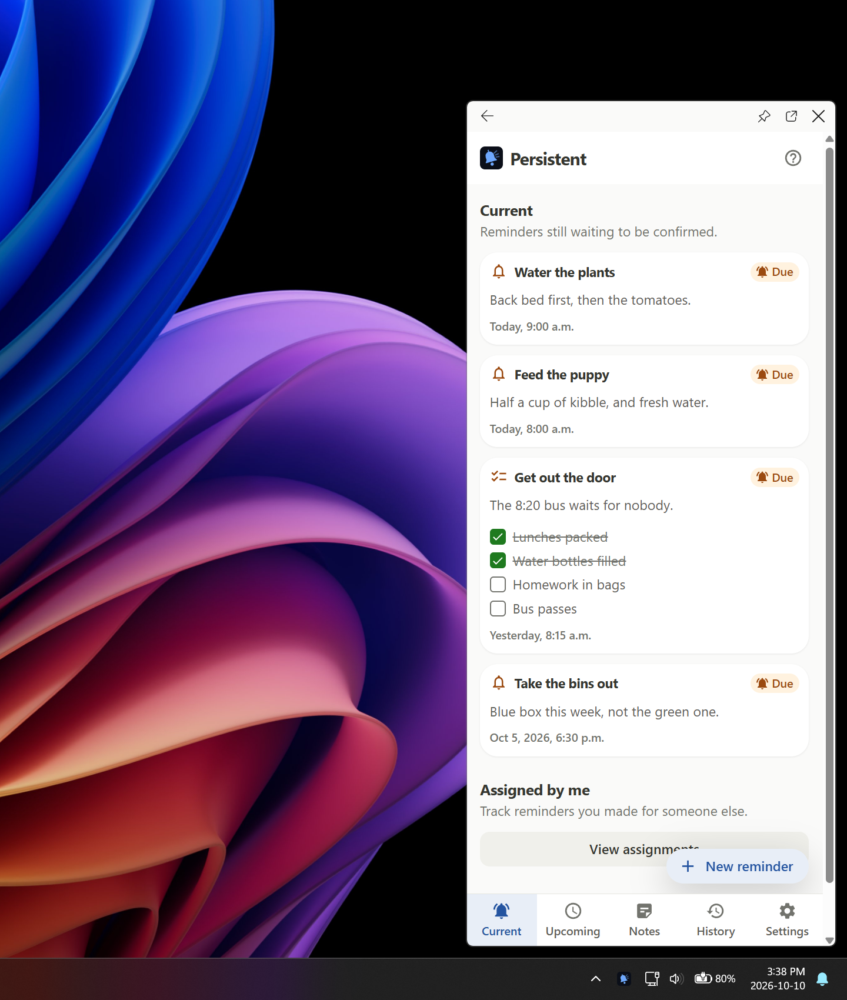
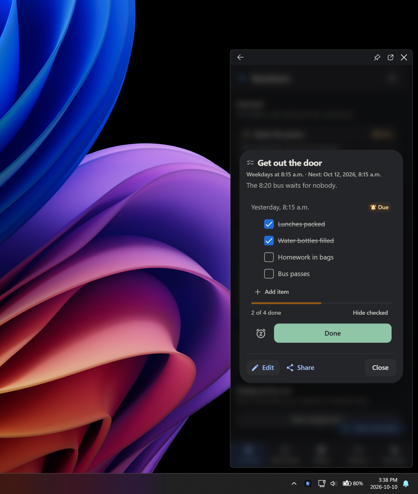
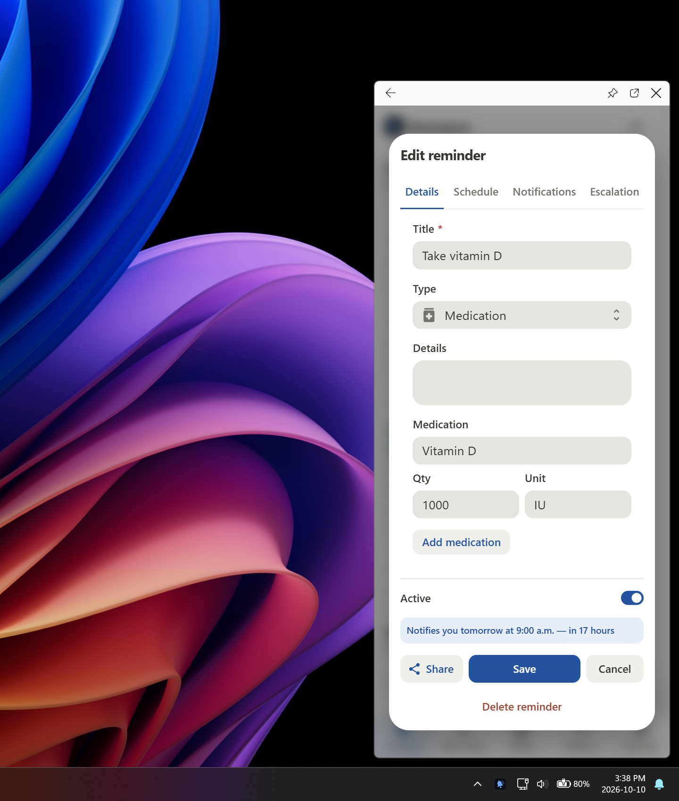
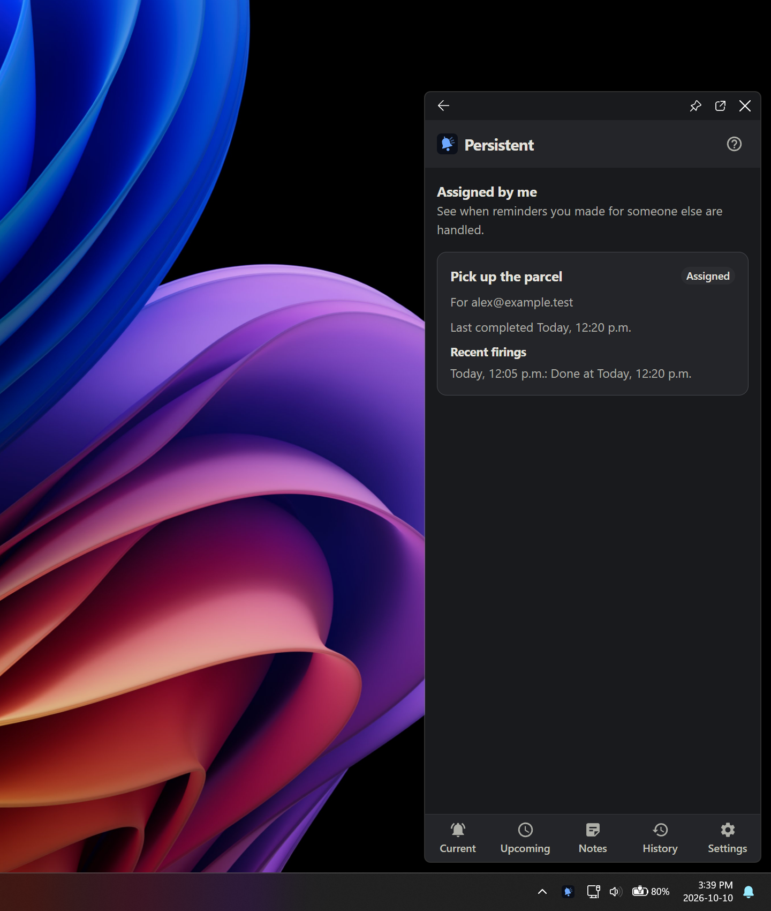

# Microsoft Store screenshot review

Four native Windows tray-flyout captures, October 10, 2026. Each export is a 1440 x 1700 RGB PNG. The default 420 x 960 DIP flyout appears above the real Windows taskbar with desktop wallpaper around it. Unrelated windows and other app tray icons are hidden during capture. App data is synthetic. Uploading is a separate step.

## Current, Enjoy Light

## Checklist, Enjoy Dark

## Medication, Enjoy Light

## Assigned by me, Enjoy Dark

