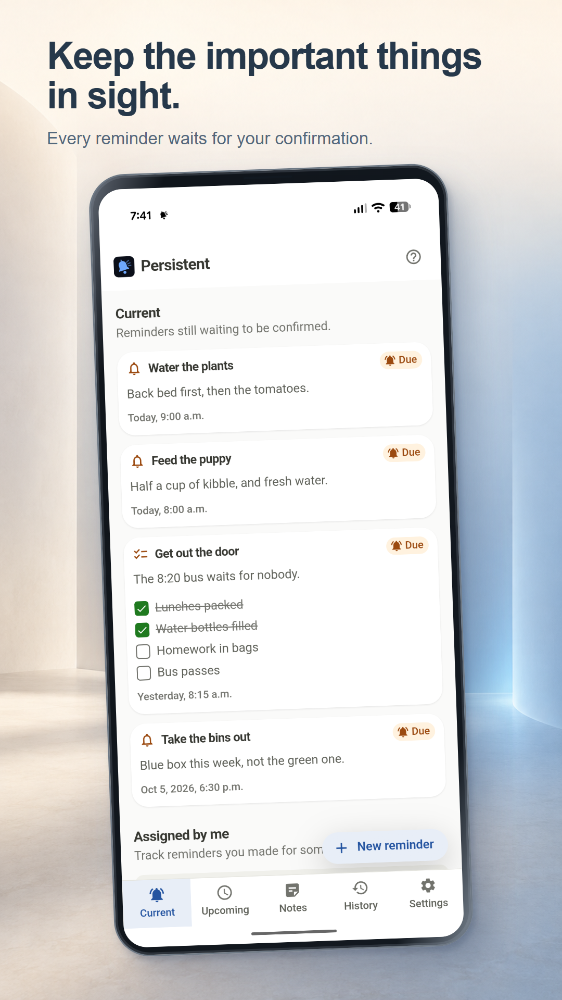
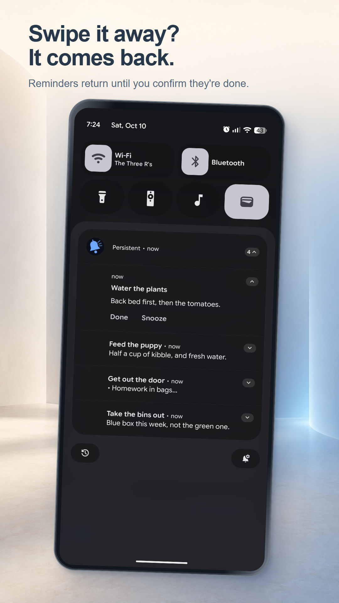
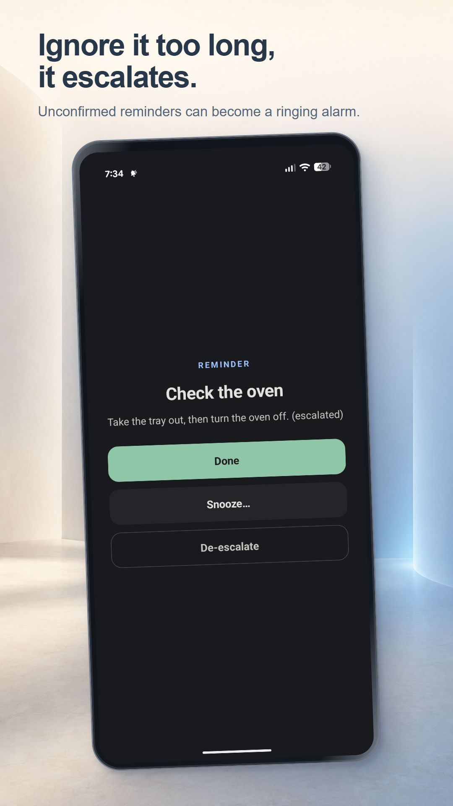
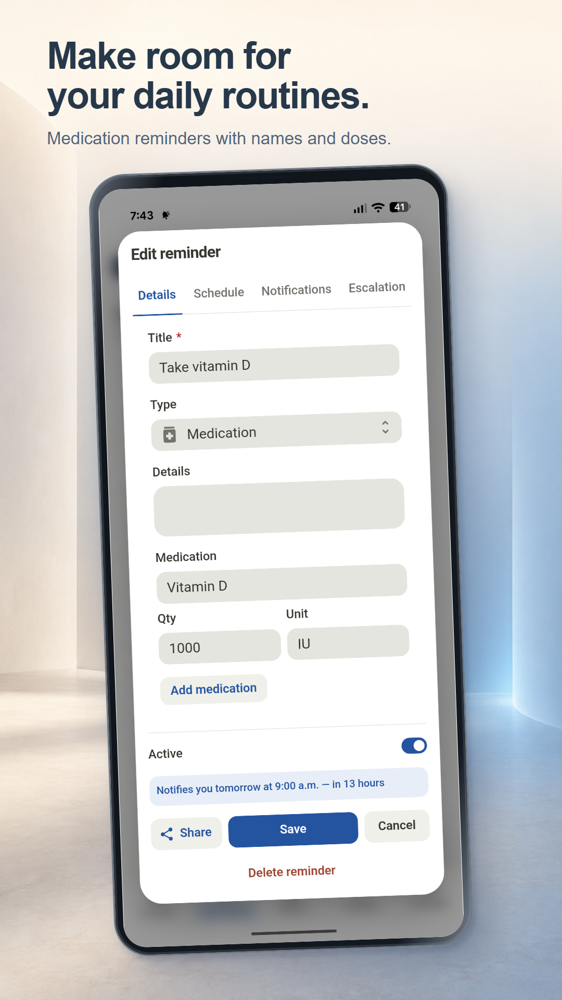
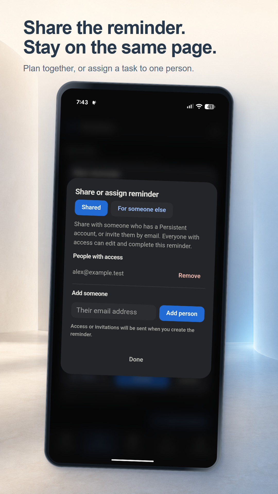
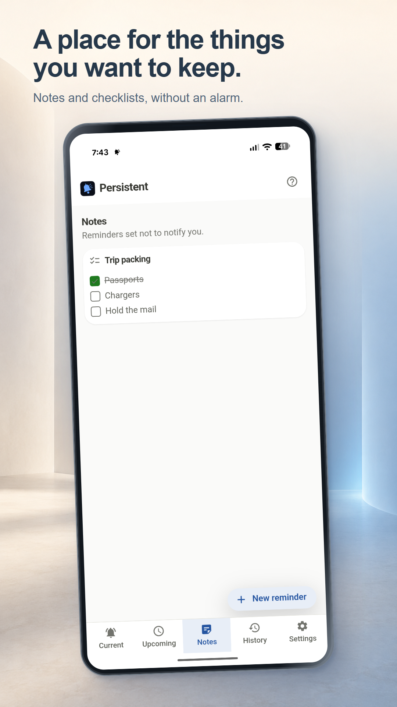
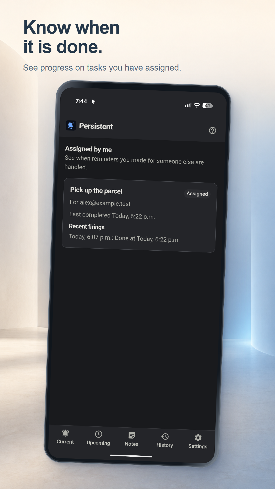

# Google Play screenshot review

Eight 1080 x 1920 RGB PNGs, with real app captures and synthetic data. Includes the real Android notification shade and escalation alarm. Uploading is a separate step.

## Keep the important things in sight.

Every reminder waits for your confirmation.

## Swipe it away? It comes back.

Reminders return until you confirm they're done.

## Ignore it too long, it escalates.

Unconfirmed reminders can become a ringing alarm.

## Finish the task. Then mark it done.

Checklists, notes, and controls in one clear view.

## Make room for your daily routines.

Medication reminders with names and doses.

## Share the reminder. Stay on the same page.

Plan together, or assign a task to one person.

## A place for the things you want to keep.

Notes and checklists, without an alarm.

## Know when it is done.

See progress on tasks you have assigned.

